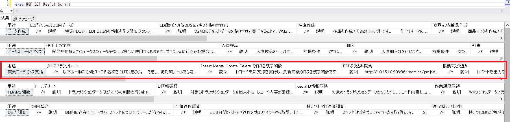
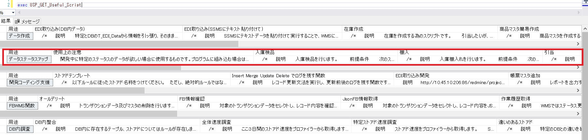

- [用語](#用語)
  - [|教育|education|WMS_EDU|手動|手動|現場教育用|](#font-colorgreen教育fonteducationwms_edu手動手動現場教育用)
- [開発手順](#開発手順)
  - [1. ローカルを作成する](#1-font-colorblueローカルfontを作成する)
  - [2. 開発する](#2-開発する)
  - [3. ソースの更新をする(local→review)](#3-ソースの更新をするlocalreview)
  - [4. レコードの更新をする](#4-レコードの更新をする)

# 用語
 
|資料内の呼び名|ソフトウェア|
|---|---|
|ADS|Azure Data Studio|
|SSMS|SQL Server Management Studio|

|資料内の呼び名|ブランチ|対象DB|Git|Jenkins|補足|
|---|---|---|---|---|---|
|本番|master|WMS|手動|自動||
|最新|review|WMS_TEST|プルリク|自動|最新ソース兼レビュー環境|
|ローカル|任意のチケット番号|WMS_○○|プルリク|手動|個人のローカル環境|
|教育|education|WMS_EDU|手動|手動|現場教育用|
---
# 開発手順

## 1. ローカルを作成する 
 ルール
1. DB名称は個人が特定できる名前にしてください。  
例:WMS_NEGO

2. 最新環境から復元してください。

3. チケット番号毎にブランチを切ってください。

4. 

補足
* SSMS・ADSどちらを使用してもよいです。
* 復元はSSMSの方が時間指定やファイル選択が優れているので複製しやすいです。

## 2. 開発する
ルール
> ストアドを作成する場合
> 
1. 作成したストアドには **USP_L_Script** を使用してできるログを入力します。<>
2. 下記ルールで@Retを使用してください。
3. メインテーブルへの更新は必ずトランザクションをかけてください。
4. ワークテーブルへの更新ではトランザクションをかけないでください。
5. ワークテーブルを作成しないようにJsonで渡せるように設計するのが吉です。
6. insert/update/delete/mergeはUSP_CMD系のストアドを使用してください。
> テーブルを作成する場合
ワークテーブルには必ず＠PC_NMと＠Work_CDを入れてください。
  

補足
* ストアド開発は **[USP_GET_Useful_Script]** の **開発コーディング支援** を有効活用して下さい。

* テストは **[USP_GET_Useful_Script]** の **開発コーディング支援** を有効活用して下さい。

## 3. ソースの更新をする(local→review)
ルール  
1. ADSのスキーマ比較で自分のDBとワークスペースの同期を取ります。

2. ADSでビルドして、エラーが無いことを確認します。

3. コメントにチケット番号を入力してコミット、プッシュします。

4. プルリクを作成します。

## 4. レコードの更新をする
ルール
* USP_GET_Useful_Scriptの用途 **データ作成** の **レコード内容変更用テーブル実行内容チェック** を使用して、更新エビデンスをRedmineに残します。
* USP_GET_Useful_Scriptの用途 **データ作成** の **レコード内容変更用テーブルへインサート** を使用して、更新対象DBのW_Upsert_Recordにインサートしてください。

補足
* USP_GET_Useful_Scriptにもコメントがありますが、すぐに更新したい場合、 **USP_JOB_Upsert_Tables** を実行する必要があります。
  