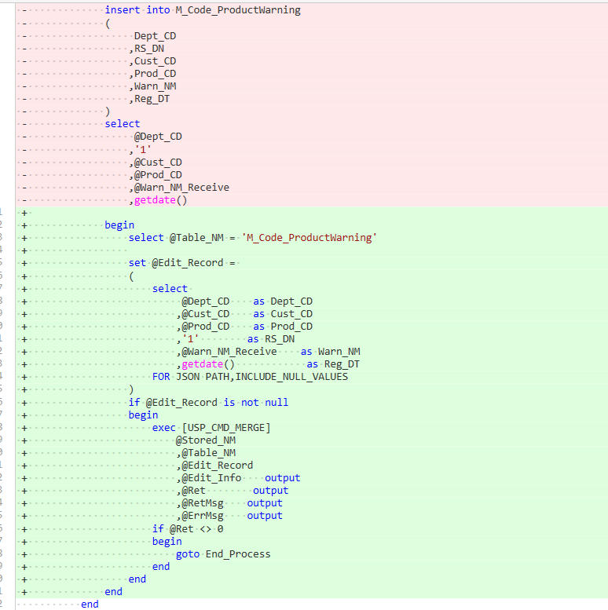
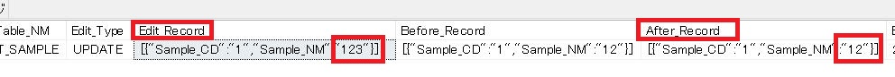
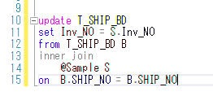
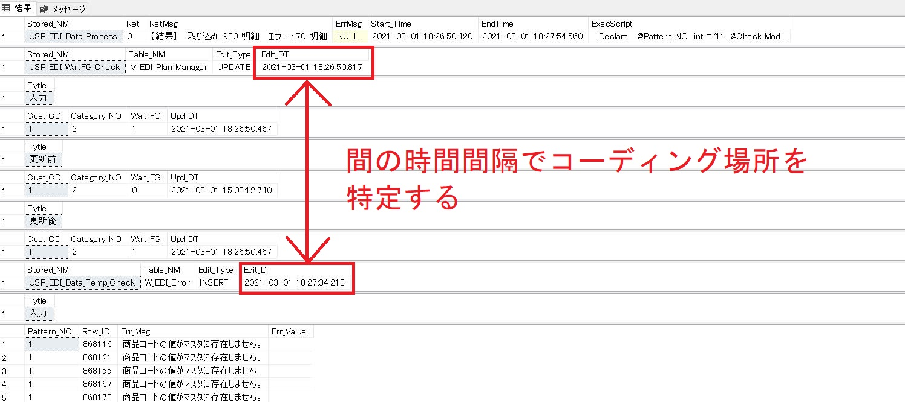

# レコードログについて
## はじめに
    今後のWMSの開発において、一般的な構文である[update][delete][insert][merge]は使用しないものとします。
    基本は下記のストアドを使用してください。
    USP_GET_Useful_Scriptに追加済みです。

## ストアド
    USP_CMD_DELETE
    USP_CMD_INSERT
    USP_CMD_UPDATE
    USP_CMD_MERGE

|パラメータ|output|説明|渡す際のルール|
|---|---|---|---|
|@Table_NM||更新する対象テーブル|存在する物理テーブルを入れる。＃や＠などストアド内で宣言したテーブルは使用不可。主キーが存在するテーブルである。|
|@Edit_Record||更新する為の情報をJsonで格納して渡す。|主キーを入れる.Jsonなので更新項目は大文字小文字まで物理テーブル項目名と合わせる。|
|@Edit_Info|○|更新結果が格納される。|実行するストアドの前に使用している場合、その情報にプラスで情報を入れる為、ストアド内で@Edit_Infoに更新をかけないようにする。|
|@Ret|○|いつもの通り、外側のストアドに正常かエラーかを伝える為のもの||
|@RetMsg|○|いつもの通り、外側のストアドにユーザー表示内容を伝える為のもの||
|@ErrMsg|○|いつもの通り、外側のストアドにシステムログ格納エラー内容を伝える為のもの||

---
## 一般的な構文との違い

**一般**
~~~SQL:
--更新対象の指定
Declare  @Cust_CD varchar(50) = '1'
		,@Prod_CD varchar(50) = 'P001'

--更新内容
Declare  @Prod_NM nvarchar(120) = 'テスト商品'

update M_Code_Product
set Prod_NM = @Prod_NM
where Cust_CD = @Cust_CD
and Prod_CD = @Prod_CD
~~~

**FBWMS関数**　　

~~~SQL:
--更新対象の指定
Declare  @Cust_CD varchar(50) = '1'
		,@Prod_CD varchar(50) = 'P001'

--更新内容
Declare  @Prod_NM nvarchar(120) = 'テスト商品'
		
~~~
ここから先が関数への渡し方

> 改修ポイント:
> * @Table_NMに更新対象を入れる
> * @Edit_Recordに主キー＋更新項目と内容を入れる
> * USP_CMD_の後は次のいずれか(UPDATE/INSERT/DELETE/MERGE)
~~~SQL:

--USP_CMD_○○○で使用する変数の宣言
Declare
   @Stored_NM		varchar(200)
  ,@Ret			int
  ,@RetMsg		varchar(500)
  ,@ErrMsg		varchar(1000)
  ,@Edit_Info		nvarchar(max)
--上記パラメータはストアドのログの方で宣言しているので、処理前に宣言する必要はほとんど無い(@Retと@RetMsgは宣言されていない事もある)
~~~
~~~SQL:
  ,@Table_NM		varchar(100)
  ,@Edit_Record	nvarchar(max)
  
	begin
		select @Table_NM = 'M_Code_Product'
				
		set @Edit_Record = 
		(
			select 
				@Cust_CD  Cust_CD
				,@Prod_CD Prod_CD
				,@Prod_NM　Prod_NM
			FOR JSON PATH,INCLUDE_NULL_VALUES
		)
		if @Edit_Record is not null
		begin
			exec [USP_CMD_UPDATE]
			    @Stored_NM
				,@Table_NM
				,@Edit_Record
				,@Edit_Info	output
				,@Ret		output
				,@RetMsg	output
				,@ErrMsg	output
			if @Ret <> 0
			begin
				goto End_Process
			end
		end
	end			
~~~

---
## USP_CMD_○○の処理内容
* 主キーを元に更新
* 変更の為に渡した変数(@Edit_Record)を@Edit_infoに格納
* 変更前のレコード内容を@Edit_infoに格納
* 変更後のレコード内容が@Edit_infoに格納※1
* 変更後の登録時刻を@Edit_infoに格納
    
> ※1 主キーがインクリメントである場合、変更後のレコードログは残らない。

---
## 処理後の格納先
* L_Retの項目であるEdit_InfoにJsonで格納されている。

  * Edit_Infoを分解するとその中に下記内容のテーブルが存在する

|項目名|説明|補足|
|---|---|---|
|Table_NM|更新対象テーブル||
|Edit_Type|更新処理内容||
|Edit_DT|更新後の時刻||
|Edit_Record|更新する為の情報|DELETEでは残さない(変更前レコード情報さえ分かればログとして問題ない為)。|
|Before_Record|更新前のレコード内容|INSERTでは残さない(変更前に存在していたらバグである為)。UPDATEでは残さない(変更後のテーブルが分かれば良い為)。|
|After_Record|更新後のレコード内容|DELETEでは残さない(消えているので更新後の情報はそもそもない)。|

### 格納レコード照会セレクション
    L_RetのRec_IDを[USP_L_Ret_DataSelect]に渡せば情報がセレクションで返ってくる。

---
## メリット
* ログがエビデンスになる。

* ソースを見なくても更新内容がわかる。

* マスタの更新前情報がわかる(現在は最新しかわからず、知る術は復元のみ)
* 削除されたワークテーブル情報がわかる(現在は処理都度消している)
* インサートで項目を指定しなくてもよい。
  

* 桁数エラーが発生しない(デメリットとしても上げている)
  
* 連結プログラムチョンボが発生しづらい。
  
  
* プロファイラーを使用しなくてもざっくりの範囲で処理が遅いのが分かる可能性がある。
  

* コーディングスキルが少々低くてもセレクションがかければ問題ない。

  
## デメリット
* 容量圧迫可能性がある.

  * L_RetはTaskDailyにて一日一回カットされる為、１日内で問題が発生しなければよいと考えている。
  
* 更新ロジックはテーブル定義桁数でJson分解するが、その際に自動的に桁数カットが走る。
  
  * 定義書との比較やテストなどでエビデンスを残せば問題ない。
 
* プロファイラーで速度遅延がわかりづらいかもしれない。更新処理のストアドが遅い場合はすべて１つのストアドとしてしか引っかからない為。
  
  * 処理遅延の多くは連結方法であったりするので、USP_CMD系のストアドに渡す前に遅くなっているケースがほとんどと想定される為、これが遅い場合があまりないと思われる。
  * 処理が遅くなっている箇所は今回残すレコードログを見てもわかると思われる。
---
## 開発時の注意
* 外側のストアドで@Edit_Infoを使用している場合、対象ストアドで@Edit_Infoをoutputで宣言する必要がある。
* @Edit_Infoに次々とレコードが格納されていくのでその分処理が重くなっていく可能性がある。レコード数が多いストアドである場合は負荷テストは必須である。
* キーを更新する事はできないので、その場合は一般的な構文で更新する。但し、本来そのような更新が起こるテーブル設計もよくはないので、根本的なことも整理した上で対応するのが吉。
---
## 問題発生時の対処法
* 速度遅延が発生した場合
  * シンプルに普通の構文に変更してください。
  * 遅延ストアドでいくつものUSP_CMDを使用している場合は@EDI_Infoを都度クリアしてください。
* 想定外エラーが発生した場合
  * 臨機応変に宜しくおねがいします。
---
## ログ残しを行わなかったストアドとテーブル

### 理由
    項目バイト数が巨大なテーブルである。又はレコード数が大幅である。結果導入すると更新が遅くなり、容量圧迫の懸念がある。

|ストアド|テーブル|
|---|---|
|USP_EDI_Data_Temp_Insert|W_EDI_○○○|
|USP_EDI_Data_Upsert|T_EDI_○○○|
|USP_API_EDI_Import|W_EDI_Data|
|USP_EDI_FileJsonValue_Insert|W_EDI_Data|
|USP_EDI_FileValue_NormalEDI_DataInsert|W_EDI_Data|
|USP_EDI_FileValue_XML_EDIData_DataInsert|W_EDI_Data|
|USP_PC_F_File_Import_DataUpdate|W_EDI_Data|
|USP_JOB_TaskDaily_DataUpdate|H_Stock_Table/M_Foward_Arrival|
|USP_EDI_FileValue_Insert|W_EDI_TMP/H_EDI_TMP|
|USP_EDI_FileXmlValue_Insert|W_EDI_TMP/H_EDI_TMP|
|USP_PC_F_Progress_WorkHistory_DataUpdate|T_Progress_WorkHistory|
|USP_PC_F_File_BatchFile_DataUpdate|H_BatchFile|

### 理由
    キーに対する更新を行っている為
|ストアド|テーブル|
|---|---|
|USP_HHT_ShipmentCagoChange_DataUpdate|W_Cago_Shipment/T_PAS_Trace|
|USP_PC_F_Master_Lead_Time_Sub_DataUpdate|M_Code_LeadTime|

### 理由
    更新と同時に変数に値を入れ、それを後続処理で使用している為
|ストアド|テーブル|
|---|---|
|USP_COM_NO_DataSelect|M_Number_○○○|
|USP_PC_F_File_ResultExport_DataUpdate|M_EDI_Export_JOB|

### 理由
    オールデリートの一種なのでログを残す必要はない

|ストアド|テーブル|
|---|---|
|USP_EDI_Pattern_Delete|M_EDI_○○○/W_EDI_○○○/T_EDI_○○○|
